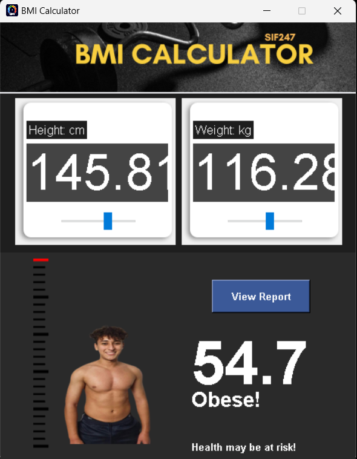
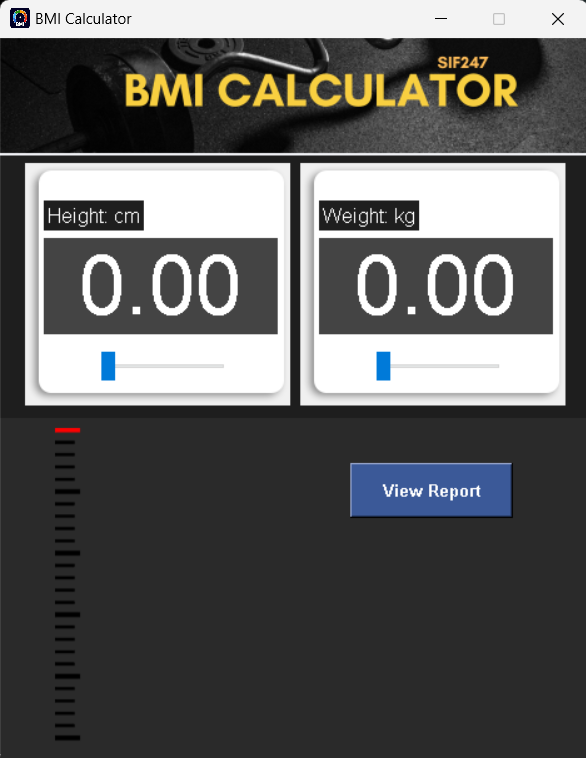

# BMI Calculator

BMI Calculator is a desktop application written in Python using the Tkinter library, which allows users to calculate their **Body Mass Index** (BMI) based on their height and weight. The user interface is designed to be intuitive and modern, with slider controls and dynamic visualization.

## Features

- BMI calculation based on height (in centimeters) and weight (in kilograms).
- Interactive adjustment of height and weight through sliders.
- BMI classification based on standard guidelines (underweight, normal, overweight, obese).
- Modern and user-friendly graphical interface with custom images and colors.
- Display of personalized health suggestions based on the BMI result.

## How It Works

1. Set your height using the slider on the left or manually enter the value in the "Height" field.
2. Set your weight using the slider on the right or manually enter the value in the "Weight" field.
3. Click the "View Report" button to calculate your BMI.
4. The result will be displayed at the bottom, along with a classification and health advice.

## Requirements

- **Python 3.x**
- **Tkinter** (usually pre-installed with Python)
- **Pillow** (for image handling)

To install Pillow, you can run:

```bash
pip install Pillow
```

## How to Run

1. Clone or download the project to your local directory.
2. Make sure you have the required dependencies installed.
3. Run the main Python file:

```bash
python bmi_calculator.py
```

## Project Structure

- **bmi_calculator.py**: The main file containing the application's logic and graphical interface.
- **Sprites/**: The folder containing all images used in the application, such as icons and backgrounds.

## Interface Example

<p align="center">
  
  
  
</p>
