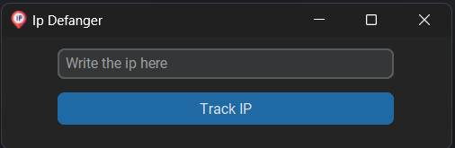
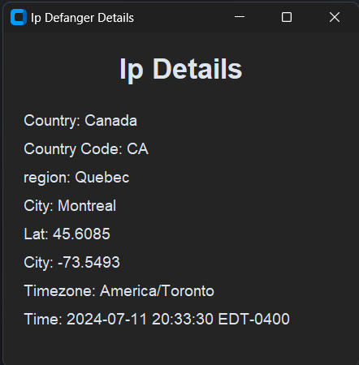

<div align="center">

<h1>Ip Defanger</h1>
</div>
<p align="center">This project allows you to defang some ip informations, using ip-api.com, it was created with CustomTkinter and: </p>


### The Project Preview
<div align="center">
    
    
</div>

### Tools 🛠️
Was used the next softwares:
- Python
- Libraries:
  - CustomTkinter
  - Tkinter
  - requests
  - ipaddress


### How to run

```bash
# Clone the project repository
git clone https://github.com/angelo-francisco/Ip-Defanger.git

# Acess the venv(can be diff. in other OS)
./venv/Scripts/Activate

# Run the project
python cd/main.py
```

## License 🔑

The license of the project is [MIT](https://opensource.org/license/mit)

<hr>
Made by Ângelo Francisco 🖖.