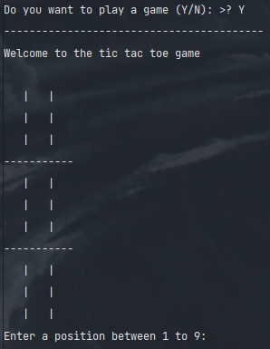

# Tic-Tac-Toe Game:
- This is just a basic tic-tac-toe game made in python without any module
- The game can be played in the console window

- Here is a screenshot of the game:

- You are required to input the number of the index where you want to play your move.